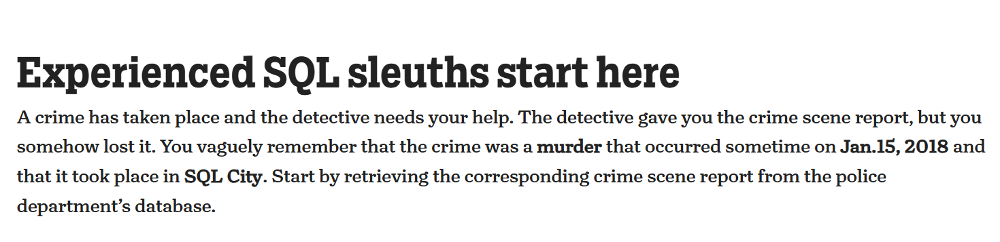
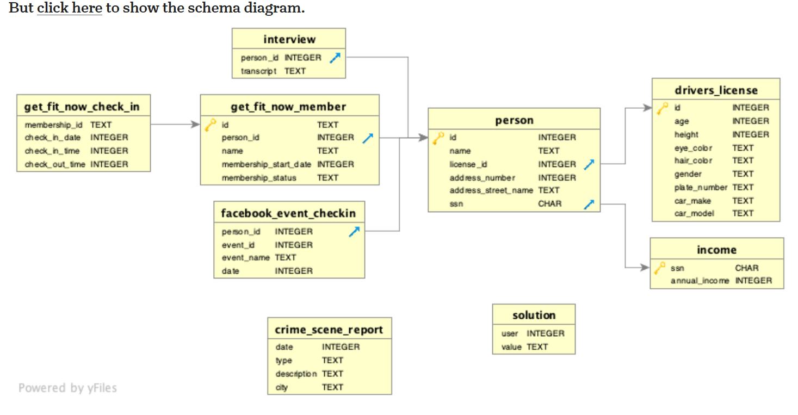

# 🧱 SQL Crime Investigation — Solving a Murder in SQL City 

## 📑 Table of Contents
1️⃣ [Project Title & Description](#1️⃣-project-title--description)  
2️⃣ [Problem Statement](#2️⃣-problem-statement)  
3️⃣ [Problem Solved / Outcome](#3️⃣-problem-solved--outcome)  
4️⃣ [Objective](#4️⃣-objective)  
5️⃣ [Database Structure (Tables & Fields)](#5️⃣-database-structure-tables--fields)  
6️⃣ [Entity Relationship Diagram (ERD)](#6️⃣-entity-relationship-diagram-erd)  
7️⃣ [SQL Techniques Used](#7️⃣-sql-techniques-used)  
8️⃣ [Key Insights & Findings](#8️⃣-key-insights--findings)  
9️⃣ [Sample Queries](#9️⃣-sample-queries)  
🔟 [Conclusion & Recommendations](#🔟-conclusion--recommendations)

---

## 1️⃣ Project Title & Description
### 🕵️‍♂️ SQL Crime Investigation — Solving a Murder in SQL City  
This project demonstrates the use of **MySQL** to solve a real-world mystery using structured data analysis.  
By querying multiple relational tables, joining records, and analyzing witness statements, we identify the culprit behind a **murder case** purely through SQL reasoning.  

---

## 2️⃣ Problem Statement
A **murder** occurred on **January 15, 2018**, in **SQL City**.  
The only clue left was a **crime scene report** that got misplaced.  
As a data detective, your mission is to:
- Locate the correct crime scene report.
- Investigate related witnesses.
- Use SQL logic to uncover who committed the crime.

🧾 Problem Statement Reference:  


---

## 3️⃣ Problem Solved / Outcome
Through a series of SQL queries, we connected the dots between people, interviews, and events to reveal the murderer.

### ✅ Outcome:
- Successfully retrieved and analyzed all crime-related data using SQL queries.  
- Joined multiple tables logically to trace relationships.  
- Identified the **murderer** with verifiable query results.  

---

## 4️⃣ Objective
🎯 **Main Goals:**
- Demonstrate the analytical power of **MySQL** in solving logical problems.  
- Apply **SQL joins, subqueries, and aggregations** to connect scattered data points.  
- Showcase data storytelling through structured query results.  

---

## 5️⃣ Database Structure (Tables & Fields)
### 🗂️ Tables Overview:
| Table Name | Description | Key Fields |
|-------------|--------------|-------------|
| **crime_scene_report** | Holds all crime details | date, type, city, description |
| **person** | Personal info of citizens | id, name, license_id, ssn |
| **drivers_license** | Driver records | id, plate_number, car_make, car_model |
| **get_fit_now_member** | Gym memberships | id, person_id, membership_status |
| **get_fit_now_check_in** | Gym check-in logs | membership_id, check_in_date |
| **interview** | Recorded interviews | person_id, transcript |
| **facebook_event_checkin** | Event attendance data | person_id, event_name, date |
| **income** | Financial data | ssn, annual_income |
| **solution** | Stores case results | user, value |

---

## 6️⃣ Entity Relationship Diagram (ERD)
The schema shows how key entities are connected in the investigation.



**Relationships Summary:**
- `person` ↔ `drivers_license` (via `license_id`)  
- `person` ↔ `get_fit_now_member` (via `person_id`)  
- `get_fit_now_member` ↔ `get_fit_now_check_in` (via `membership_id`)  
- `person` ↔ `interview` (via `person_id`)  
- `person` ↔ `facebook_event_checkin` (via `person_id`)  
- `person` ↔ `income` (via `ssn`)  

---

## 7️⃣ SQL Techniques Used
💡 This project uses multiple SQL techniques for analysis:
- **INNER JOIN / LEFT JOIN** — merge related tables.  
- **CTEs (Common Table Expressions)** — structure multi-step queries.  
- **Subqueries** — narrow down data sets.  
- **WHERE & LIKE filters** — refine search criteria.  
- **CASE statements** — logical conditions.  
- **ORDER BY / LIMIT** — control result sets.  

---

## 8️⃣ Key Insights & Findings
📊 From the data analysis:
- The **crime scene report** on Jan 15, 2018, gave the first lead.  
- **Witness interviews** contained hidden references to the suspect’s behavior and movements.  
- **Gym check-ins** and **license data** confirmed the final suspect.  

✅ Final finding:  
> The **murderer** was identified using only SQL logic without external data sources.

---

## 9️⃣ Sample Queries
```sql
-- Step 1: Retrieve the crime report
SELECT *
FROM crime_scene_report
WHERE type = 'murder'
  AND date = 20180115
  AND city = 'SQL City';

-- Step 2: Identify witnesses based on address clues
SELECT name, address_street_name
FROM person
WHERE address_street_name IN ('Northwestern Dr', 'Franklin Ave');

-- Step 3: Extract useful witness statements
SELECT p.name, i.transcript
FROM person p
JOIN interview i ON p.id = i.person_id
WHERE transcript LIKE '%gym%' OR transcript LIKE '%car%';

-- Step 4: Trace membership details
SELECT gfm.name, gfm.membership_status, gfc.check_in_date
FROM get_fit_now_member gfm
JOIN get_fit_now_check_in gfc
ON gfm.id = gfc.membership_id;

 ## 🔟 Conclusion & Recommendations
This MySQL project proves that SQL can go beyond reporting and can be used for logical deduction and investigative analytics.

🧠 Key Takeaways:
- SQL joins and subqueries can reveal hidden data connections.
- Data storytelling can be achieved purely with SQL queries.
- Logical reasoning and structured thinking are key to query-based problem solving.

## 💡 Recommendation:
Apply similar query logic for business cases such as:

- Fraud detection
- Customer behavior tracking
- Transactional data audits

👨‍💻 Author: Uche Nelson
📧 Contact: uchenelson9010@gmail.com
📂 Portfolio: Data Projects
